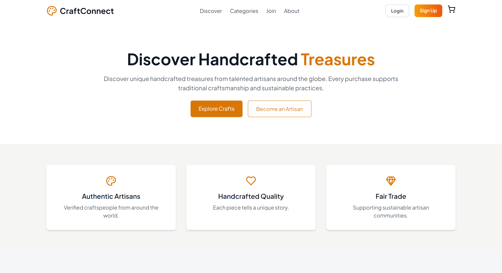

# Craft-Connect -Frontend 

Artisan E-commers platform.

📋 Table of Contents

  1. 🤖 Introduction
  2. ⚙️ Tech Stack
  3. 🛠️ Features  
  4. 🗓️ Planned Features
  5. 🚀 Getting Started

🤖 Introduction

This platform connects unique artisan creations with discerning customers, addressing the need for a tailored e-commerce experience that showcases artisanal goods. Key benefits include:

- **Expanded Reach**: Helping artisans connect with a wider audience.
- **Curated Selection**: Providing customers with a carefully chosen array of products.
- **Robust Management Tools**: Equipping artisans with the tools they need to succeed.

The platform's goals are to drive sales, foster community, and ensure secure transactions. Designed to be scalable, secure, and user-friendly, this project represents the front end of the platform.

⚙️ Tech Stack  

- **React**: A JavaScript library for building user interfaces.
- **Vite**: A fast build tool and development server for modern web projects.
- **ESLint**: A static code analysis tool for identifying problematic patterns in JavaScript code.
- **Tailwind CSS**: A utility-first CSS framework for creating custom designs.
- **MUI**: A popular React UI framework for faster and easier web development.
- **Emotion**: A library for writing CSS styles with JavaScript.
- **Axios**: A promise-based HTTP client for making requests.
- **i18next**: A powerful internationalization framework for JavaScript.
- **React Query**: A data-fetching library for React applications.
- **ApexCharts**: A charting library for visualizing data.
- **React Router**: A library for routing in React applications.
- **React Toastify**: A library for providing notifications in React.

🛠️ Features

- **Shopping Cart Features**:
  - **Add to Cart**: Allows users to add products to their cart for purchase.
  - **Remove from Cart**: Enables users to easily remove items from their cart.
  - **Update Item Quantity**: Users can adjust the quantity of products in their cart.
  - **Clear Cart**: Provides an option for users to empty their entire cart.
  - **Place Order**: Users can finalize their purchase, and orders are securely stored in the database.
- **Security and Authentication**:
  - **User Authentication**: Ensures secure login and protection of user data.
- **Admin Panel**:
  - **Category Management**: Admins can create, edit, and organize product categories.
  - **Category Descriptions**: Admins have the ability to add detailed descriptions for categories.
- **Artisan Tools**:
  - **Product Management**: Artisans can upload products and assign them to categories.
  - **Image Upload**: Allows artisans to add images to their product listings.
  - **Pricing**: Artisans can set and update product prices.
- **User Experience**:
  - **Product Information**: Users have access to detailed product descriptions and specifications.
  - **Responsive Design**: The application is optimized for all devices, ensuring a consistent user experience.

🗓️ Planned Features

- **Admin Dashboard**: Features add like AliExpress.
- **real-time order tracking**: Users can track their orders in real time.

🚀 Getting Started

To get started with this project, follow these steps:

- **Create a `.env` file**: In the root of your project directory, include the following environment variable:
  **plaintext**
  VITE_API_URL="your_host"
  **Install the dependencies: Run the following command in your terminal**:
    npm install
  **Start the development server**: Run the following command in your terminal:
    npm run dev
